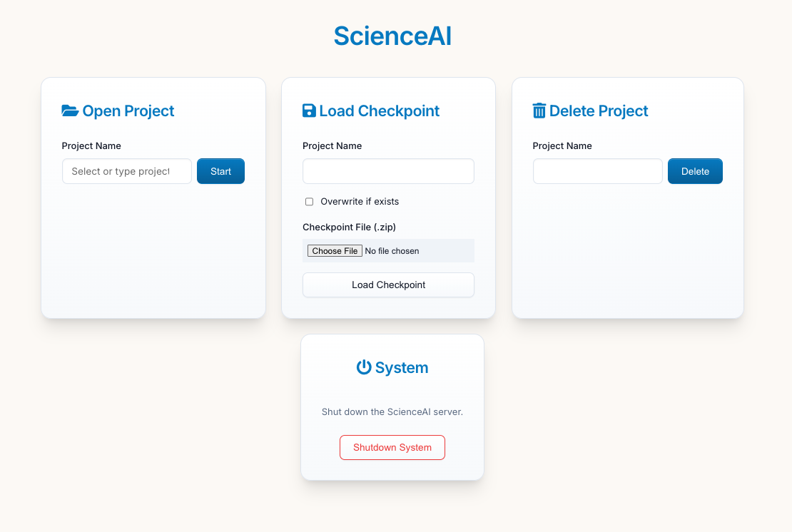
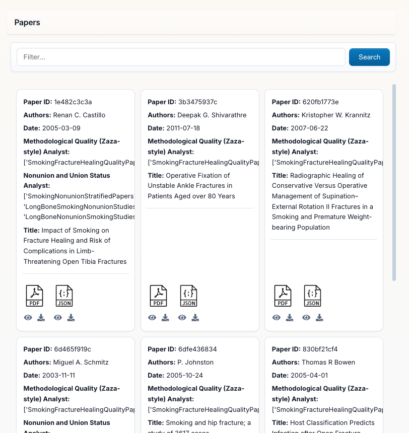
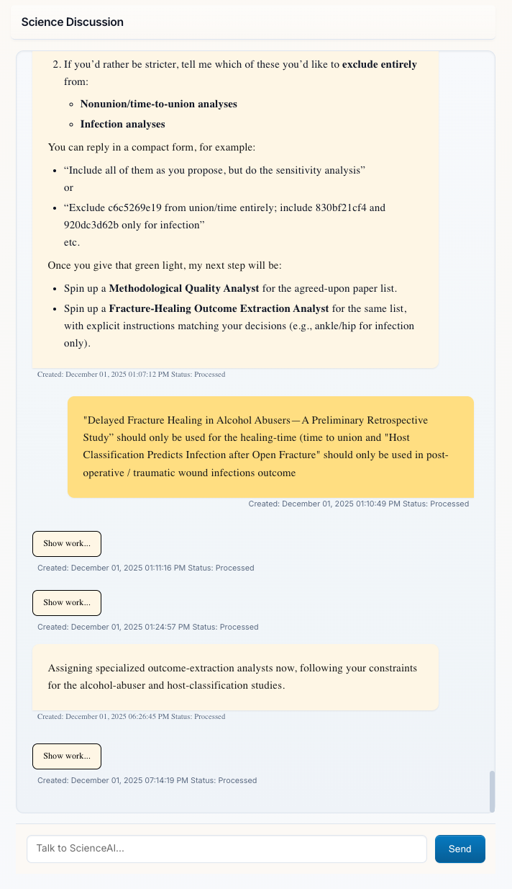
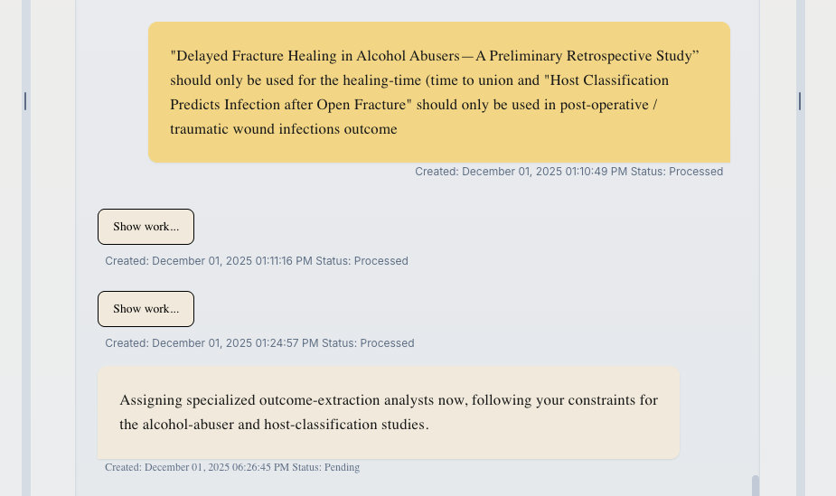
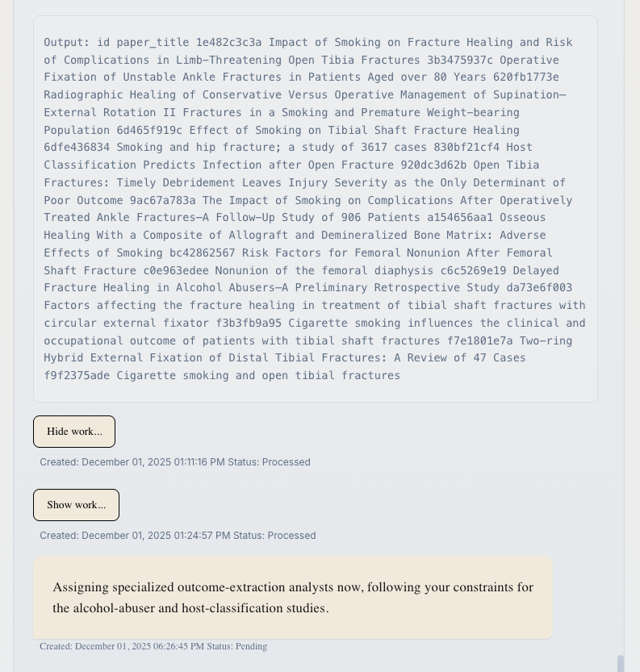
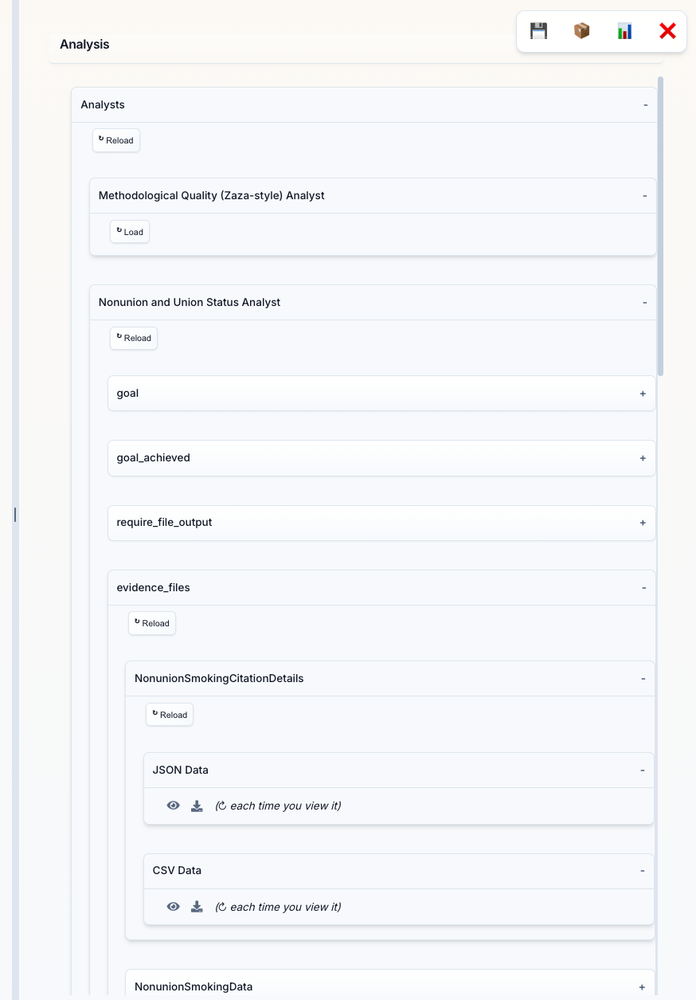
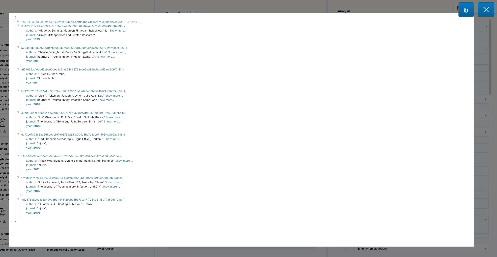
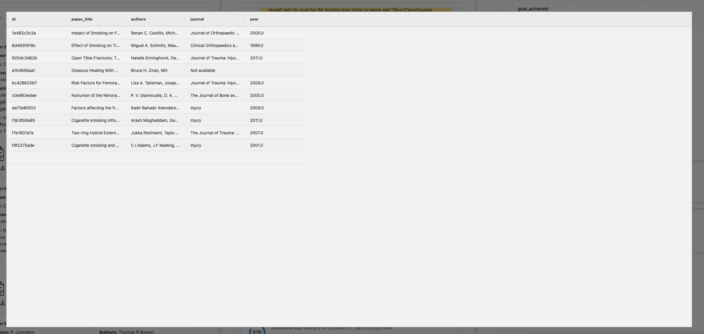
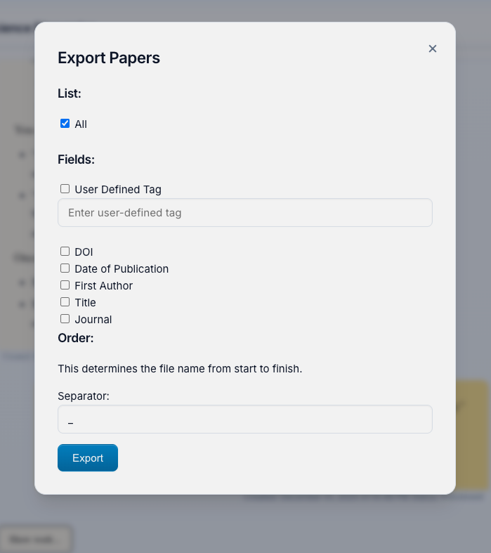

# ScienceAI

**An AI-Powered Research Assistant for Systematic Literature Analysis**

ScienceAI is a Python application that transforms how researchers analyze scientific literature. Unlike a standard LLM chatbot, ScienceAI is specifically designed to handle complex, multi-paper research tasks through an intelligent agent-based architecture.

---

## 🎯 Why ScienceAI vs. a Regular LLM Chatbot?

| Standard LLM Chatbot | ScienceAI |
|---------------------|-----------|
| Single conversation context | **Multi-agent system** with specialized analyst agents |
| Manual upload of each document excerpt | **Automatic processing** of hundreds of PDFs |
| Limited by context window (~200K tokens) | **Processes entire paper collections** regardless of size |
| Requires you to extract data manually | **Automated data extraction** with structured schemas |
| One-off responses | **Persistent analysis** with downloadable results |
| No systematic validation | **Built-in validation** and provenance tracking |
| Generic responses | **Evidence-based answers** with source citations |

### The Key Difference: Agentic Architecture

ScienceAI employs a **Principal Investigator (PI)** that:
- Breaks down your research question into manageable sub-tasks
- Creates specialized **Analyst Agents** for each sub-task
- Coordinates parallel data extraction across your entire paper collection
- Synthesizes findings from multiple analysts
- Provides comprehensive, evidence-backed answers

This means you can ask: *"Extract healing times, sample sizes, and intervention types from all these papers"* and ScienceAI will automatically create the right analysts, define extraction schemas, process all papers, and return structured CSV data—something impossible with a standard chatbot.

---

## 🚀 Main Features

- **📚 Automated Paper Processing**: Upload PDFs and let ScienceAI extract text, figures, tables, and metadata automatically
- **🤖 AI-Driven Multi-Agent Analysis**: The PI delegates tasks to specialized Analyst Agents that work autonomously
- **📊 Structured Data Extraction**: Define data schemas and extract information systematically across all papers
- **💬 Interactive Research Discussion**: Ask complex research questions and receive evidence-backed answers
- **🔍 Provenance Tracking**: Every extracted data point includes source quotes and derivation explanations
- **📈 Export & Visualization**: Download extracted data as CSV, export papers with metadata, view analysis results in an interactive interface
- **💾 Project Management**: Save and resume research projects with full checkpoint support

---

## 📦 Installation

**Requirements**: Python 3.11+ and an OpenAI API key

```bash
pip install scienceai-llm
```

---

## 🎬 Getting Started

### 1. Launch ScienceAI

```bash
scienceai
```

This starts a local web server. Open your browser to:
```
http://localhost:4242
```

You will be prompted to enter your OpenAI API key. This key is used to authenticate requests to the OpenAI API. You can find your API key in your OpenAI account settings.

Enter your project name and click **"Start"** to create a new project or load an existing one.



### 2. Understanding the Interface



**Papers Panel (Left Side)**: This is your literature library showing all uploaded PDFs with:
- **Search Bar** at the top to filter papers by title, author, or keywords
- **Automatically Detected Metadata**: Author, Date, Title, Journal
- **Paper IDs**: Each paper gets a unique identifier
- **Analyst Tracking**: Shows which analysts have processed each paper

You can upload PDFs individually or as a zip folder during project creation.

---

### 3. Chatting with the Principal Investigator



**Science Discussion Panel (Right Side)**: This is where you interact with the Principal Investigator (PI). The PI:
- Understands complex research questions
- Plans multi-step analysis strategies  
- Creates and manages Analyst Agents to accomplish your goals
- Presents synthesized findings with evidence

**Key Features:**
- **Message Status**: Messages show "Processed" (waiting for your input) or "Pending" (PI is working)
- **"Show work..." Links**: Click to see detailed tool calls and PI reasoning (see below)
- **Timestamps**: Track when each interaction occurred

#### 🔍 Transparency: "Show work..." Feature



Messages from the PI include a **"Show work..."** link. This transparency feature lets you see exactly what the PI is doing behind the scenes.



**Click "Show work..."** to reveal:
- **Tool Calls**: Every function the PI called (e.g., `read_paper_chunks`, `create_analyst`, `search_database`)
- **Arguments**: The exact parameters passed to each tool
- **Outputs**: Results returned from each operation
- **Reasoning**: The PI's step-by-step decision-making process

This is invaluable for:
- **Understanding** how ScienceAI processes your requests
- **Debugging** unexpected results
- **Learning** how to phrase better questions
- **Trust** through complete transparency

Click **"Hide work..."** to collapse the details again.

**Example Questions to Ask:**
- *"Extract sample sizes, intervention types, and outcomes from all studies"*
- *"Which papers found significant effects for [specific intervention]?"*
- *"Create a summary table comparing study methodologies"*
- *"What are the outcome measures used across these papers?"*

---

### 4. Working with Analyst Agents



**Analysis Panel (Bottom Section)**: When you request data extraction or specific analyses, the PI creates specialized **Analyst Agents**. This panel shows:

- **Analyst Categories**: Different types of analysts (e.g., "Study Categorization & Eligibility Analyst", "Nonunion and Union Status Analyst")
- **Data Collections**: Each analyst creates structured data collections with names like "NonunionSmokingData2"
- **Load Button**: Click to view the extracted data in a table format
- **Download Button**: Export data as CSV for analysis in Excel, R, or Python

Each analyst autonomously:
1. Defines an extraction schema based on your request
2. Processes all relevant papers
3. Validates extracted data for accuracy
4. Provides results with source citations

---

### 5. Viewing Extracted Data

**Data Tables**: Click "Load" on any data evidence_files to see the extracted data in a structured table format. Each row represents data from a paper, with columns showing:

- **Standard Fields**: Data you requested (e.g., smoking status, healing time, sample size)
- **Provenance Metadata**: Automatically added by ScienceAI
  - `_source_quote`: The exact text from the paper supporting this data
  - `_derivation`: Explanation of how calculated/inferred values were determined
  - `_source_location`: Where in the paper this data was found

**Key Features:**
- **Sortable Columns**: Click headers to sort
- **Download CSV**: Click the download button to export for further analysis
- **Source Verification**: Every data point links back to the original paper text

#### 👁️ Viewing Raw Data: JSON and CSV Viewers

In the **Analysis Panel**, each data collection offers multiple view formats:



**JSON Data Eye Icon (👁️)**: Click the eye icon next to "JSON Data" to open an interactive JSON viewer featuring:
- **Syntax Highlighting**: Easy-to-read colored formatting
- **Collapsible Sections**: Expand/collapse nested objects and arrays
- **Copy Button**: Copy the entire JSON to clipboard
- **Raw Format**: See the exact data structure as stored



**CSV Data Eye Icon (👁️)**: Click the eye icon next to "CSV Data" to open a spreadsheet-style viewer with:
- **Grid Layout**: See your data in familiar rows and columns
- **Quick Preview**: View data without downloading
- **Inspect Format**: Check CSV structure before exporting

These viewers help you:
- **Verify** data quality before export
- **Debug** extraction issues by inspecting raw values
- **Choose** the best format (JSON vs CSV) for your workflow
- **Inspect** data structure and field types

Click the **Close** button or press **Esc** to dismiss the viewer.

---

### 6. Exporting Your Work



**Export Button (📦)**: Located in the bottom control panel, this opens the Export Papers menu where you can:

**Select Papers to Export:**
- **All**: Export every paper in your project
- **User Defined Tag**: Filter by custom tags you've applied

**Customize Filenames** with detected metadata:
- Choose which fields to include: DOI, Date, First Author, Title, Journal, Tags
- Set the order of fields in the filename
- Choose separator (underscore, dash, space)
- Preview: `2023_Smith_ImplantFailureRates_JBJS.pdf`

**Bottom Control Panel Buttons:**
- **💾 Checkpoints**: Download auto-generated checkpoint saves that allow you to resume your project at the last saved state or share it with others
- **📦 Export**: Export papers with custom filenames
- **📊 Extracted Data**: Combines ALL extracted data into a single CSV file that you can use for analysis and verification of extracted data quality (column names may be very long, so you may want to rename them)
- **❌ Close**: Return to project selection screen

---

## 💡 Example Use Cases

### 1. **Systematic Literature Reviews**
Upload 100+ papers, ask the PI to categorize them by intervention type, extract study characteristics, and generate summary tables—all automatically.

### 2. **Meta-Analysis Data Extraction**
Request extraction of effect sizes, sample sizes, and study parameters. ScienceAI handles the schema definition, extraction, validation, and CSV export.

### 3. **Research Gap Analysis**
Ask "What methodologies are under-represented?" and let analysts scan all papers to identify patterns and gaps.

### 4. **Evidence Synthesis**
"Summarize all findings related to [X]" triggers analysts to extract relevant sections, synthesize findings, and provide citations.

---

## 🐍 Python Library Usage

ScienceAI can also be used as a Python library to integrate its capabilities into your own scripts and applications.

### Initialization

```python
from scienceai.client import ScienceAI

# Initialize the client (starts backend automatically)
client = ScienceAI(project_name="MyResearchProject")
```

### Ingesting Papers
You can upload papers programmatically and trigger preprocessing.

```python
# Upload papers and wait for preprocessing to complete
client.upload_papers(["/path/to/paper1.pdf", "/path/to/paper2.pdf"])

# Or upload without immediate preprocessing
client.upload_papers(["/path/to/paper3.pdf"], trigger_preprocess=False)

# Manually trigger preprocessing later
client.preprocess()
```

### Chatting with the PI

Interact with the Principal Investigator to ask questions or request analyses.

```python
# Send a message and wait for the response (blocking)
response = client.chat("Summarize the findings of the uploaded papers.")
print(response)

# Non-blocking chat
client.chat_background("Extract sample sizes from all papers.")

# Poll for status
while True:
    result = client.poll()
    if result:
        print("Response received:", result)
        break
    print("Working...")
    time.sleep(1)

# Get full history
history = client.history()
```

---

## 🏗️ How It Works: Architecture Overview

### The Principal Investigator (PI)
Your main interface—a conversational AI that:
- Understands research objectives
- Plans analysis strategies
- Creates and manages Analyst Agents
- Synthesizes multi-agent findings
- Communicates results clearly

### Analyst Agents
Specialized workers created on-demand:
- Each has a focused research goal
- Autonomously defines data schemas
- Extracts, validates, and exports data
- Provides evidence-backed conclusions

### Data Extraction Engine
- **Flexible Schemas**: Support for numbers, dates, text blocks, categorical data, and more
- **Derivation Support**: Extract calculated or inferred values with explanations
- **Automatic Provenance**: Every data point links to source location and quotes
- **Validation**: Built-in error checking and re-extraction on failure

### Database & Storage
- Persistent project storage
- Efficient paper and metadata management
- Data collection tracking
- Checkpoint and export functionality

---

## 🔧 Configuration

### OpenAI API Key Setup

On first run, you'll be prompted to enter your OpenAI API key. Alternatively, set it as an environment variable:

```bash
export OPENAI_API_KEY="your-api-key-here"
```

### Advanced Options

ScienceAI uses environment variables for configuration:
- `OPENAI_API_KEY`: Your OpenAI API key (required)
- Default server port: `4242` (accessible at `http://localhost:4242`)

---

## 📚 Detailed Documentation

### 🧠 Principal Investigator (PI)
The **Principal Investigator** (`src/scienceai/principal_investigator.py`) is the central orchestrator of the system. It uses an LLM-driven reasoning loop to:

1.  **Plan Research**: Decomposes user queries into sub-tasks.
2.  **Delegate**: Spawns **Analyst Agents** using `delegate_research()` to handle specific data extraction or analysis tasks.
3.  **Execute Code**: Uses `run_python_code()` to perform statistical analysis, generate plots, or manipulate data using Python (pandas, matplotlib, etc.).
4.  **Synthesize**: Aggregates results from multiple analysts using `reflect_on_delegations()` to provide a cohesive answer.
5.  **Transparency**: All PI actions are recorded and visible via the "Show work..." feature in the UI, exposing tool calls, arguments, and internal reasoning.

### 🕵️ Analyst Agents
**Analyst Agents** (`src/scienceai/analyst.py`) are specialized, autonomous workers created by the PI. Each analyst has a specific `goal` (e.g., "Extract patient demographics") and follows this workflow:

1.  **Paper Selection**: Identifies relevant papers using `get_all_papers()` or filters by criteria.
2.  **Schema Generation**: Automatically generates a JSON schema for data extraction based on its goal.
3.  **Concurrent Extraction**: Runs `extract_data()` across all selected papers in parallel.
4.  **Validation**: Uses `reflect_on_evidence()` to verify that extracted data is supported by the source text.
5.  **Data Collection**: Saves structured results into a named collection (e.g., `DemographicsData`) which becomes available to the PI and the user.

### ⛏️ Data Extraction Engine
The **Data Extraction Engine** (`src/scienceai/data_extractor.py`) is the core NLP component responsible for turning unstructured PDF text into structured data.

-   **Supported Types**: `number`, `date`, `text_block`, `categorical`, `boolean`, `array`, `object`.
-   **Provenance Injection**: Automatically adds metadata to every extracted field:
    -   `_source_quote`: The verbatim text from the paper supporting the data.
    -   `_source_location`: Page number and context.
    -   `_derivation`: Logic used to calculate values (e.g., "Calculated as 15 males + 12 females").
-   **Reflection & Validation**: The `reflect_on_data_extraction()` function acts as a critic, comparing the extracted JSON against the paper's text to catch hallucinations or errors before saving.

### 💾 Database & Storage
Managed by `DatabaseManager` (`src/scienceai/database_manager.py`), the system uses a file-based storage approach for portability and simplicity.

-   **Paper Ingestion**: PDFs are hashed (`sha256`) to prevent duplicates. Text, tables, and figures are extracted and stored.
-   **Storage Format**: Uses `dictdatabase` to store project state, chat history, and data collections as JSON files.
-   **Checkpoints**: The system supports full project checkpointing. The `save_database()` function creates a zip archive of the project directory, allowing users to backup, share, or resume their work at any time.
-   **Export**: Data can be exported as CSVs, and papers can be renamed/exported based on their metadata.

---

## 🤝 Contributing

We welcome contributions! Here's how:

- **Report Bugs**: Open an issue on GitHub with reproduction steps
- **Feature Requests**: Suggest new capabilities or improvements
- **Pull Requests**: Fork, develop, and submit PRs for review

---

## 📄 License

See LICENSE file for details.

---

## 🆘 Troubleshooting

**Papers not processing?**  
Check that PDFs are valid and not password-protected.

**API errors?**  
Verify your OpenAI API key is valid and has available credits.

**Analyst not completing?**  
Check the chat panel for error messages—the PI will explain any issues.

**Cannot download data?**  
Ensure analysts have completed their data collections before exporting.

---

**Ready to transform your literature review workflow? Install ScienceAI and start asking research questions!**

```bash
pip install scienceai-llm
scienceai
```
